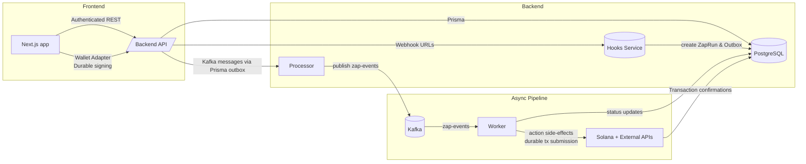

# Flowrge Architecture

> High-level reference for engineers joining the project. Covers the current (devnet) implementation only.

---

## 1. System Overview

Flowrge is a Solana-focused automation platform composed of five primary services plus shared packages:

| Service / Package | Location | Purpose |
| --- | --- | --- |
| Web App (Next.js) | `apps/web` | Flow builder UI, wallet interactions, dashboard, waitlist |
| Backend API (Express) | `apps/backend` | Auth, Flow CRUD, trigger/action catalogs, Helius integration, durable-nonce orchestration |
| Hooks Service (Express+Bun) | `apps/hooks` | Exposes `POST /hooks/catch/:userId/:zapId` for third-party webhooks; persists `ZapRun` + outbox row |
| Processor (Bun worker) | `apps/processor` | Polls `ZapRunOutbox`, publishes tasks to Kafka topic `zap-events` |
| Worker (Bun worker) | `apps/worker` | Subscribes to Kafka, executes per-action logic (email, X post, durable SOL), submits durable transactions, sends failure emails, cleans nonce accounts |
| Shared packages | `packages/db`, `packages/common`, `packages/ui`, `packages/eslint-config`, `packages/typescript-config` | Prisma client & schema, shared zod schemas/constants, UI components, tooling presets |

### 1.1 High-level diagram



---

## 2. Core Flows

### 2.1 Flow creation & durable payment setup

1. User configures trigger/actions in the web app (`apps/web/app/zap/create/page.tsx`), connecting an Anza wallet adapter.
2. On publish:
   - Frontend calls `POST /api/v1/zap/create-with-durable`.
   - Backend validates payload via `ZapCreateSchema` (`packages/common`), creates `Zap`, `Trigger`, and `Action` rows inside a transaction.
   - If at least one action is `send SOL`, backend:
     1. Ensures a `NonceAccount` exists (or creates one) funded by the company wallet on devnet (`SystemProgram.nonceInitialize`).
     2. Builds a transaction whose first instruction is `SystemProgram.nonceAdvance`, followed by all SOL transfers (and optional platform-fee transfer).
     3. Signs the tx as nonce authority (company wallet) and returns base64 to the client.
   - User signs the durable transaction client-side (`signTransaction`), then frontend stores it via `POST /api/v1/durable/save` which persists a `DurableTransaction` row (status `pending`).
3. Zap creation succeeds even though funds are not yet moved; they are locked into a durable transaction usable later.

**Key files:** `apps/backend/router/zap.ts`, `apps/backend/router/durable.ts`, `apps/web/app/zap/create/page.tsx`, `packages/db/prisma/schema.prisma`.

### 2.2 Trigger ingestion → Kafka → worker execution

1. External systems call the generated webhook URL (`https://<hooks-service>/hooks/catch/:userId/:zapId`).
2. Hooks service (`apps/hooks`) validates the zap, creates:
   - `ZapRun` storing webhook payload as JSON metadata.
   - `ZapRunOutbox` row used for delivery to Kafka.
3. Processor (`apps/processor`) polls `ZapRunOutbox`, batches rows, publishes `{ zapRunId, stage: 0 }` to the `zap-events` topic, then deletes the outbox rows (classic outbox pattern).
4. Worker (`apps/worker`) consumes `zap-events`:
   - Loads `ZapRun` + `Zap` + `Actions`.
   - Executes actions sequentially by `sortingOrder`.
   - Supported action types (as of now): email (`sendEmail`), X post (`sendXPost`), Sol transfer (`submitDurableForZapFlow`).
   - After each action, worker enqueues the next stage (if any) by publishing another Kafka message.

**Key files:** `apps/hooks/index.ts`, `apps/processor/index.ts`, `apps/worker/index.ts`, `apps/worker/utils/*`, `packages/db/prisma/schema.prisma`, `packages/common/index.ts`.

---

## 3. Durable Nonce implementation

Durable nonces guarantee that signed SOL transactions remain valid beyond the ~90-second recent blockhash window, enabling “sign now, execute later” UX.

### 3.1 Components

| Component | Responsibility |
| --- | --- |
| Backend `durableRouter` (`apps/backend/router/durable.ts`) | Create nonce accounts (company wallet authority), build partially signed durable tx, persist fully signed wires. |
| Database tables | `NonceAccount` stores rent-funded nonce accounts per zap; `DurableTransaction` stores serialized signed tx, recipients, fee payer. |
| Frontend | Requests durable build, prompts wallet signature, submits serialized tx to backend. |
| Worker (`submitDurableForZapFlow`) | Fetches pending durable tx, submits via `sendRawTransaction`, confirms, updates status, and marks `NonceAccount` as `used`. |
| Cleanup (`cleanupNonces.ts`) | Periodically withdraws lamports from used nonce accounts back to company wallet and marks them `closed`. |

### 3.2 Flow diagram

```mermaid
sequenceDiagram
  participant UI as Web App
  participant API as Backend /durable
  participant DB as Postgres
  participant W as Worker
  participant Sol as Solana Devnet

  UI->>API: /zap/create-with-durable (trigger + actions)
  API->>Sol: Create nonce account (if missing)
  API->>UI: Return signed durable tx (nonceAdvance + transfers)
  UI->>UI: Wallet signs tx (user pays fees later)
  UI->>API: /durable/save (store serializedTxB64)
  API->>DB: DurableTransaction(status=pending)
  ...
  W->>DB: Fetch pending DurableTransaction
  W->>Sol: sendRawTransaction(serializedTx)
  Sol->>W: Confirmation
  W->>DB: Update status=confirmed, mark NonceAccount used
  W->>Sol: (Background) nonceWithdraw via cleanup job
```

### 3.3 Operational notes

- Currently configured for **devnet** only; company wallet secret is read from `COMPANY_SECRET_KEY` (JSON array).
- Users cover transfer amount + network fee when the worker eventually submits the durable tx.
- Platform fee (if enabled) is appended as an extra transfer to `PLATFORM_FEE_ADDRESS`.
- Failures trigger status `failed` and an email via Resend, prompting user to re-sign.

---

## 4. Kafka-based execution pipeline

### 4.1 Topic & schema
- Single topic: `zap-events` (`packages/common` constant).
- Payload: `{"zapRunId": string, "stage": number}` where `stage` aligns with `Action.sortingOrder`.

### 4.2 Outbox pattern
- Hooks service writes to DB only.
- Processor polls `ZapRunOutbox` to ensure reliability even if Kafka is down when webhook arrives.
- Messages are only published once DB writes succeed.

### 4.3 Worker idempotency & progression
- Worker queries the zap and fetches the action matching `stage`.
- After running an action, it publishes `{ stage: stage + 1 }` unless last action.
- Offers natural retry: if consumer crashes mid-action, Kafka replays the message.
- Each action implementation is responsible for deduplication (e.g., durable SOL uses stored serialized tx so repeated submissions either confirm or error).

---

## 5. Database snapshot (PostgreSQL via Prisma)

| Table | Purpose |
| --- | --- |
| `User` | Auth identity, wallet public key, OAuth tokens. |
| `Zap` | Flow metadata (name, owner, relations to trigger/actions). |
| `Trigger` / `Action` | Lookup for configured trigger/action metadata referencing available catalogs. |
| `AvailableTrigger` / `AvailableAction` | Catalog definitions displayed in UI. |
| `ZapRun` | An execution instance containing trigger payload. |
| `ZapRunOutbox` | Queue table for Kafka processor. |
| `ZerionSubscription` | Tracks wallet subscription status via Zerion API. |
| `NonceAccount` | Per-zap durable nonce accounts controlled by company wallet. |
| `DurableTransaction` | Serialized user-signed SOL transactions pending submission. |

Refer to `packages/db/prisma/schema.prisma` for full schema and indexes.

---

## 6. External integrations

| Integration | Usage |
| --- | --- |
| **Helius SDK** (`apps/backend/index.ts`) | Currently instantiated for historic Solana webhook support (older activate route). |
| **Zerion API** (`apps/backend/router/zerion.ts`) | Creates wallet subscriptions; backend stores callback URLs pointing to Hooks service. |
| **Anza Wallet Adapter** (`apps/web/components/WalletAdaptors.tsx`) | Provides `signTransaction` for durable tx signing (devnet cluster). |
| **Resend** (`apps/worker/utils/sendDurable.ts`) | Sends email when durable submission fails. |
| **Kafka (Confluent images via Docker Compose)** | Messaging backbone connecting processor and worker. |

---

## 7. Configuration & Environments

Key environment variables (spread across services):

| Variable | Used By | Notes |
| --- | --- | --- |
| `DATABASE_URL` | All services via Prisma | Postgres connection string |
| `HELIUS_API_KEY` | Backend | Required for legacy Solana webhook activation |
| `WEBHOOKS_URL` | Backend | Base URL for Zerion callbacks → Hooks service |
| `NEXT_PUBLIC_BACKEND_URL`, `NEXT_PUBLIC_HOOKS_URL` | Web | Frontend API + webhook base |
| `COMPANY_SECRET_KEY` | Backend & Worker | JSON array secret key for nonce authority |
| `PLATFORM_FEE_ADDRESS` | Backend | Fee destination |
| `SOLANA_DEVNET_RPC` | Backend & Worker | Default `https://api.devnet.solana.com` |
| `RESEND_API_KEY` | Worker | Optional; enables failure emails |
| `KAFKA_BROKERS` | Backend (indirect), Processor, Worker, Hooks | e.g., `kafka:9092` in Docker |

Docker Compose (`docker-compose.yml`) wires together Zookeeper, Kafka, backend, hooks, processor, and worker for local development.

---

## 8. Developer onboarding tips

1. **Install Bun** (project uses Bun runtimes for backend/worker services). Ensure Node >= 18 for Next.js.
2. **Start infrastructure**:
   ```bash
   docker-compose up kafka zookeeper
   ```
3. **Run services** (separate terminals):
   ```bash
   bun run --cwd apps/backend dev
   bun run --cwd apps/hooks dev
   bun run --cwd apps/processor dev
   bun run --cwd apps/worker dev
   bun run --cwd apps/web dev
   ```
4. **Set env**: copy `.env.example` (if available) or define required vars. For devnet durable testing, seed the company wallet with SOL.
5. **Database**: run `bun run --cwd packages/db prisma migrate dev`.
6. **Testing workflow**:
   - Create a zap with a webhook trigger + send SOL action.
   - Send webhook POST to Hooks service.
   - Observe processor logs (publishing to Kafka) and worker logs (executing actions, durable submission).

---

## 9. Known gaps / future work (not yet implemented)

Documenting for awareness (do **not** treat as existing features):
- Additional action types (Discord, custom webhooks) are planned but absent.
- Platform fees are currently hardcoded to zero on frontend.
- On-chain confirmation dashboards / analytics are TBD.

---

This document should serve as the starting point for new engineers to understand how Flowrge’s current pieces fit together. Refer directly to the noted files for implementation details. For deeper dives, inspect the service-specific README files under `apps/*` and `packages/*`.


