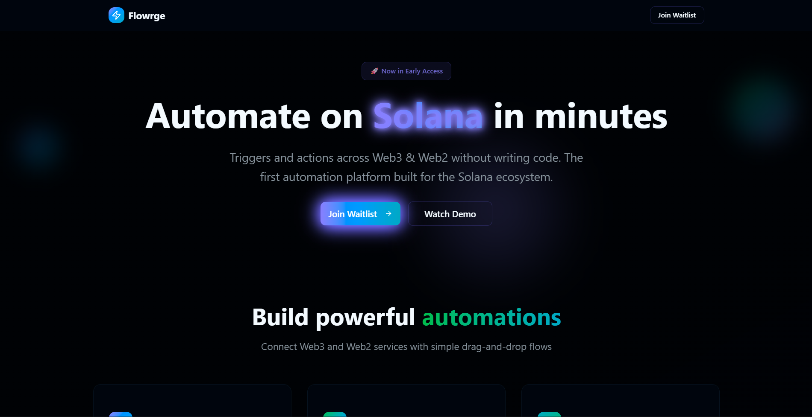

# 🌊 Flowrge

> **The first automation platform built for the Solana ecosystem**

Flowrge bridges Web2 and Web3 by enabling anyone to create powerful automations that trigger actions across both worlds. No coding required.

## What is Flowrge?

Flowrge is an automation platform that lets you create "flows" - simple workflows that connect triggers and actions across Web2 and Web3 services. Think of it as Zapier for the Solana ecosystem, but with the power to interact with blockchain events and execute on-chain actions.

### The Problem We Solve

The gap between Web2 and Web3 is real. Developers, creators, and businesses struggle to:
- Automate cross-platform workflows that involve both traditional and blockchain services
- React to on-chain events with off-chain actions
- Execute complex multi-step processes without writing custom code
- Integrate Solana with their existing Web2 tools and services

### Our Solution

Flowrge provides a visual, no-code platform where you can:
- **Create triggers** from webhooks, on-chain events, or scheduled events
- **Execute actions** like sending SOL, posting on social media, sending emails, or updating databases
- **Chain multiple actions** together in complex workflows
- **Monitor and manage** all your automations from one dashboard

## Who is Flowrge For?

### 🚀 **Developers**
- Automate payouts and rewards
- Trigger notifications on smart contract events
- Integrate Web2 services with your dApps
- Build complex workflows without infrastructure management

### ⭐ **Creators**
- Schedule social posts across platforms
- Send alerts on NFT sales or price changes
- Automate fan engagement and community management
- Connect your content strategy with blockchain events

### 📈 **Businesses**
- Process payments and manage customer data
- Connect existing tools with blockchain workflows
- Automate compliance and reporting
- Streamline operations across Web2 and Web3

## Key Features

### 🔗 **Cross-Platform Integration**
Connect any Web2 service with Solana blockchain actions. Send SOL when someone fills out a form, post on Twitter when an NFT sells, or update a spreadsheet when a transaction completes.

### ⚡ **Real-Time Triggers**
- **Webhooks**: Start flows with HTTP requests
- **On-Chain Events**: React to Solana transactions, NFT sales, token transfers
- **Scheduled Events**: Time-based triggers for recurring tasks

### 🎯 **Powerful Actions**
- **Blockchain**: Send SOL, create transactions, interact with smart contracts
- **Web2**: Send emails, post on social media, update databases, call APIs
- **Custom**: Build your own actions with our developer tools

### 🎨 **Visual Builder**
Create complex workflows with our intuitive drag-and-drop interface. No coding required - just point, click, and connect.

### 📊 **Analytics & Monitoring**
Track your flows' performance, monitor success rates, and get detailed logs of every execution.

### 🔒 **Reliable Solana Transactions with Sanctum Gateway**
Flowrge now uses **Sanctum Gateway** for all on-chain transactions, giving:

- ⚡ **Near 100% reliability** – automatic retries and failure handling
- 👀 **Full observability** – dashboard with status, confirmations, and metrics
- 🧩 **On-chain & off-chain sync** – emails, webhooks, and SOL always aligned
- 🔄 **Optimized delivery** – faster confirmations with smart RPC routing
- 🛡️ **Secure & validated** – safe signing and replay protection

With Gateway, Flowrge workflows are production-ready and consistent across both frontend and worker flows.

## Getting Started

1. **Sign up** for early access
2. **Create your first flow** by choosing a trigger and action
3. **Test and deploy** your automation
4. **Monitor** your flows from the dashboard

## Architecture

Flowrge is built as a modern, scalable platform with:

- **Frontend**: Next.js web application with beautiful, responsive UI
- **Backend**: Express.js API with authentication and flow management
- **Database**: PostgreSQL with Prisma ORM for reliable data storage
- **Message Queue**: Kafka for handling flow executions asynchronously
- **Workers**: Distributed processing for executing actions
- **Webhooks**: Dedicated service for receiving external triggers
- **Indexer**: For indexing on blockchain and monitoring on-chain events

## Early Access

Flowrge is currently in early access. Join our waitlist to be among the first to experience the future of Web3 automation.

---

**Ready to automate the future?** [Join the waitlist](https://flowrge.xyz) and start building flows that bridge Web2 and Web3.
